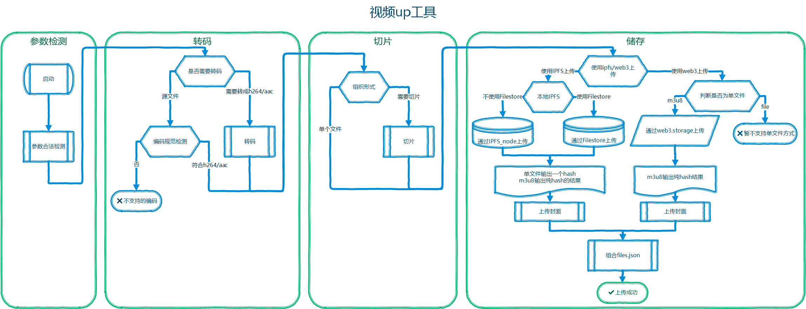
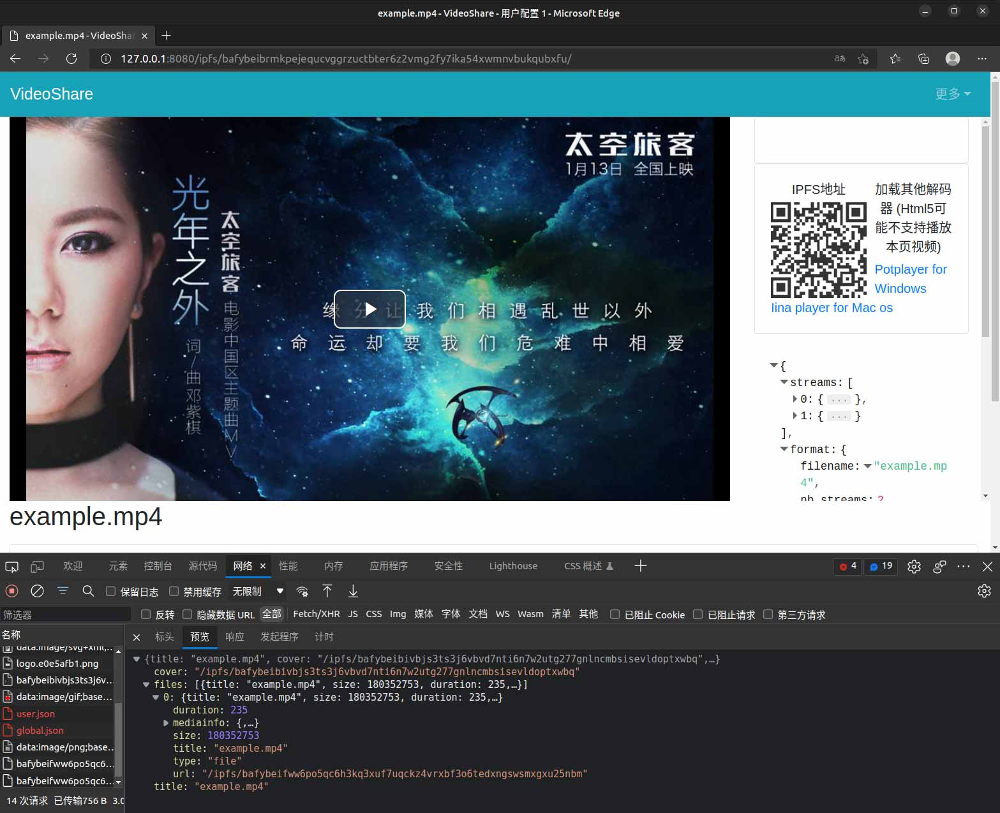
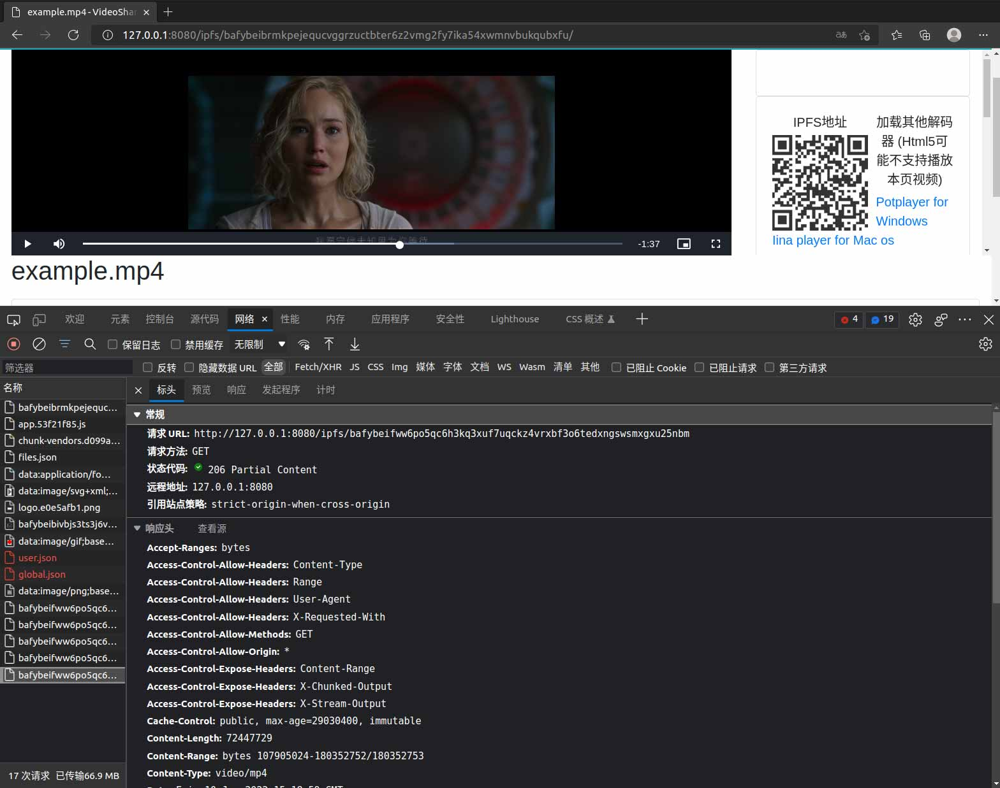
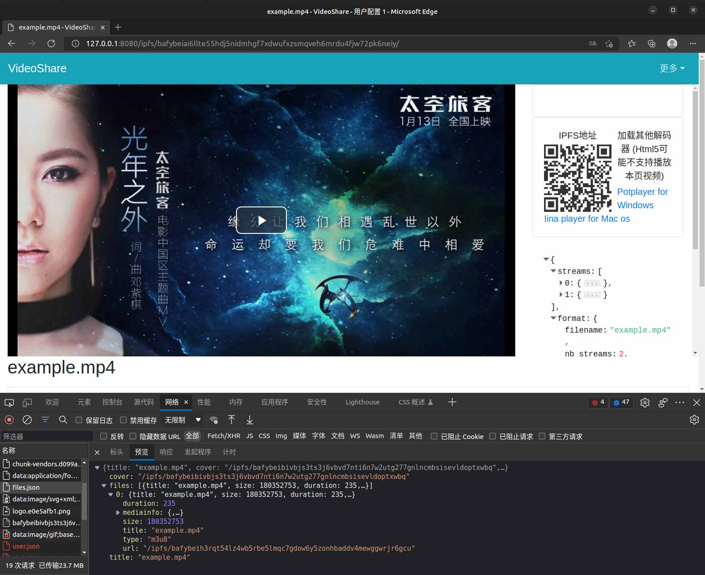
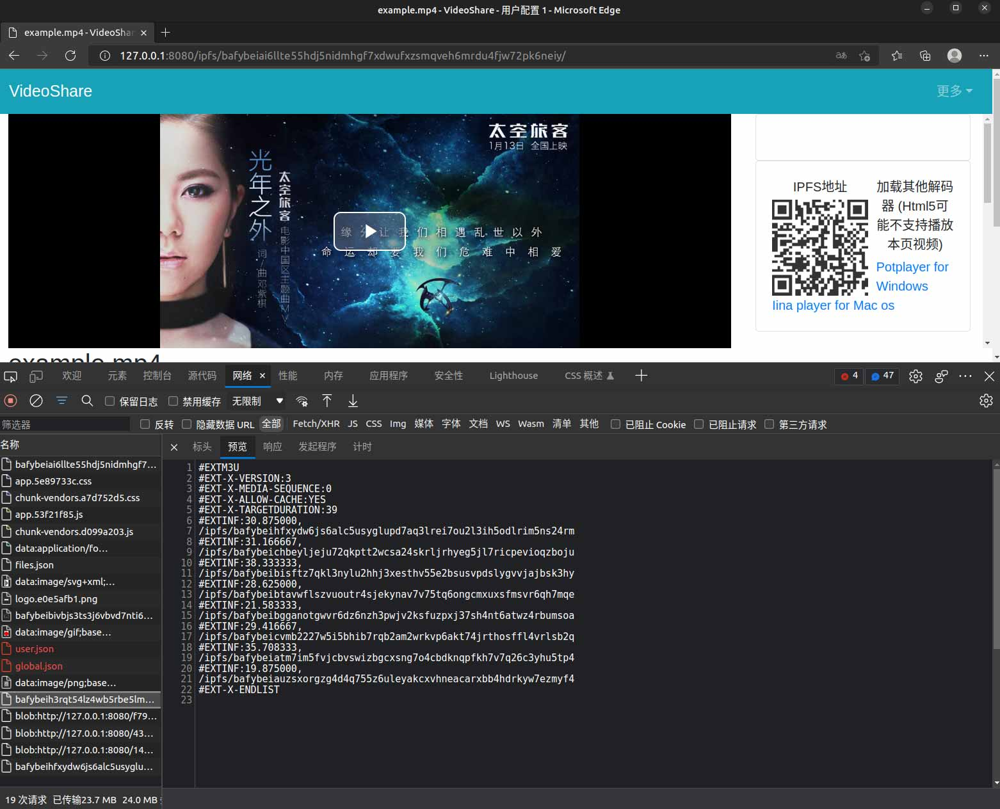
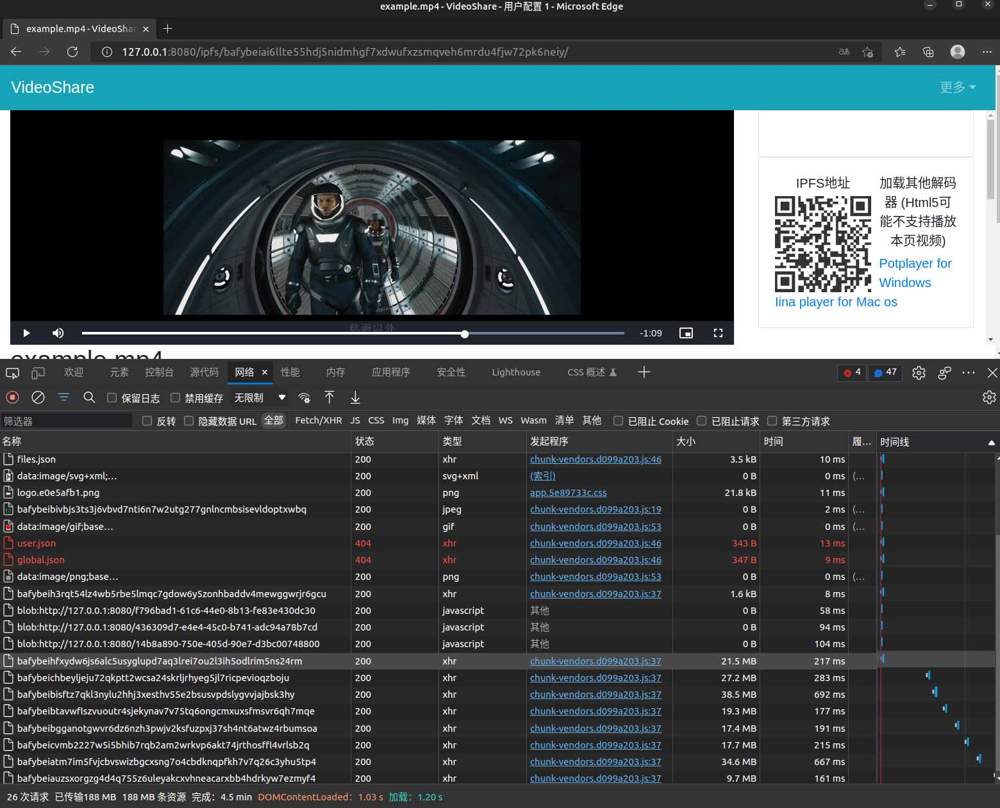

# ipfs-video-up-tool
ipfs协议的视频辅助上传工具

# 功能
1. - [x] 支持在线播放的编码检测
2. - [x] 支持转码，转成支持在线播放的编码标准
3. - [x] 支持切片，
4. - [x] 支持上传到自行搭建的ipfs节点,单文件形式
5. - [x] 支持上传到自行搭建的ipfs节点,m3u8形式
6. - [x] 支持上传到ipfs节点的Filestore方式,单文件形式
7. - [x] 支持上传到ipfs节点的Filestore方式,m3u8形式
8. - [x] 支持上传到web3.storage,支持m3u8形式
9. - [x] 支持封面,输出组合成files.json,给 [player](https://github.com/bill080307/VideoShare/tree/master/player) 项目

# 流程图

# 使用说明
## 安装
### ubuntu中直接安装
~~~bash
apt install -y python3 python3-pip ffmpeg
pip3 install -r requirements.txt
~~~
### 使用docker
~~~bash
docker build -t ipfs-video-up-tool:v0.0.1 .
~~~

## 选项
###  ubuntu中直接运行
本脚本通过环境变量传递选项
~~~bash
export UP_mode=file                        # 上传的方式，支持file单文件模式;m3u8切片模式
export UP_up_mode=ipfs                     # 存储方式，支持ipfs普通模式;ipfsFile(ipfs启用Filestore的方式);web3使用协议实验室的web3.storage;fileCoin直接使用filecoin主网络
export UP_encode=False                     # 是否启用转码，为了更好的适配HTML5，开启转码将会转成h264/aac格式
export UP_ipfs_api=/ip4/127.0.0.1/tcp/5001 # 传递ipfs的api地址，采用多地址格式(Multiaddr)
export UP_web3_token=eyJhbG.....           # 使用web3作为存储时，web3帐号的token
export UP_cover=cover.jpg

python3 Update.py Example.mkv          #脚本第一个参数为输入的文件。
python3 Update.py Example.mkv /output  #脚本第二个参数为输出文件夹。
~~~
特别注意：使用Filestore时，1. 运行脚本的文件系统和ipfs node所在的文件系统要同时在相同路径上挂载被上传的文件；2. ipfs repo和被上传的文件根目录需要使用同一个；3. 需要转换文件时，如UP_encode=True或者UP_mode=m3u8时上传的是output文件夹内的文件，否则为输入文件本身；
### 使用docker运行
~~~bash
docker run \
    -e UP_mode=file \
    -e UP_up_mode=ipfs \
    -e UP_encode=False \
    -e UP_ipfs_api=/ip4/127.0.0.1/tcp/5001 \
    -e UP_web3_token=eyJhbG..... \
    -e UP_cover=cover.jpg \
    -v /input_dir:/data \
    -itd ipfs-video-up-tool:v0.0.1 /data/Example.mkv
~~~

## 示例
使用file模式上传

file: /ipfs/bafybeifww6po5qc6h3kq3xuf7uqckz4vrxbf3o6tedxngswsmxgxu25nbm  
files.json: /ipfs/bafybeidxgsx57zyysfaras5u7zkksclwb4myfe35mp4mbsxqtkohcjgas4  

使用m3u8模式上传

m3u8: /ipfs/bafybeih3rqt54lz4wb5rbe5lmqc7gdow6y5zonhbaddv4mewggwrjr6gcu  
files.json: /ipfs/bafybeifv6hasa7v24kojrhxg3o333lzithfchlsrzz3pwsne65qtkx5usi  

添加files.json 到 [player项目](https://github.com/bill080307/VideoShare/tree/master/player)

file模式播放器截图:

m3u8模式播放器截图:

